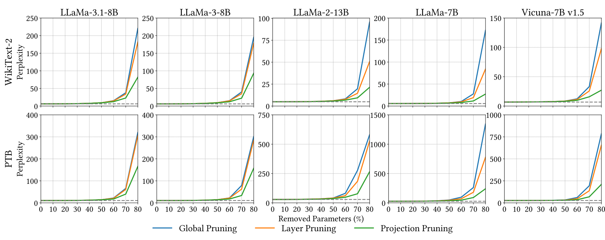

#  [Mosaic: Composite Projection Pruning for Resource-Efficient LLMs ](https://doi.org/10.1016/j.future.2025.108056)

Official PyTorch implementation of  **Mosaic**: Composite Projection Pruning for Resource-Efficient LLMs

[Bailey Jack Eccles](https://scholar.google.com/citations?user=qMdsQCsAAAAJ&hl=en), Leon Wong, Blesson Varghese

**University of St Andrews, Rakuten Mobile, Inc.**


<p align="center">

</p>


## Installation 
--- 
Installation instructions can be found in [INSTALL.md](INSTALL.md).


## Usage

--- 
We provide a quick overview of the arguments:  
- `--model`: The identifier for the LLaMA model on the Hugging Face model hub.
- `--cache_dir`: Directory for loading or storing LLM weights. The default is `llm_weights`.
- `--prune_method`: Pruning methods,namely [`wanda_owl`,`wanda_owl_structure`,`sparsegpt_owl`,`magnitude`, `wanda`, `sparsegpt`, `sparsegpt_mosaic`].
- `--sparsity_ratio`: Denotes the percentage of weights to be pruned.
- `--save`: Specifies the directory where the result will be stored.
- `--Hyper_m`: Denotes the hyperparameter of `M`.
- `--Lamda`:  Denotes the hyperparameter of `Lamda`.


--- 
### Script example of pruning llama-7b using Mosaic

```
python   main.py    \
--model_name_or_path decapoda-research/llama-7b-hf     \
--Lamda 0.08 \
--Hyper_m 5 \
--model decapoda-research/llama-7b-hf     \
--prune_method sparsegpt_mosaic     \
--sparsity_ratio 0.7 \
--sparsity_type unstructured \
--save save_test/
```

### Zero-shot evaluation

#### Step1: generation data: 

```
bash scripts/data_genration/run.sh 
```
#### Step2: obtain prediction:
```
bash benchmark/run.sh 
```
#### Step3: evaluation results: 

```
bash benchmark/eval.sh
```

### Acknowledgement
This repository is build upon the [Wanda](https://github.com/locuslab/wanda), [SparseGPT](https://github.com/IST-DASLab/sparsegpt), and [OWL](https://github.com/luuyin/OWL) repositories. 


## Citation
if you find this repo is helpful, please cite

```
@article{ECCLES2025108056,
    title = {Mosaic: Composite projection pruning for resource-efficient LLMs},
    journal = {Future Generation Computer Systems},
    year = {2025},
    issn = {0167-739X},
    doi = {https://doi.org/10.1016/j.future.2025.108056},
    url = {https://www.sciencedirect.com/science/article/pii/S0167739X25003516},
    author = {Bailey J. Eccles and Leon Wong and Blesson Varghese},
}
```
